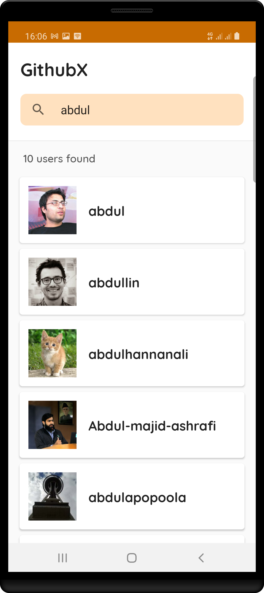
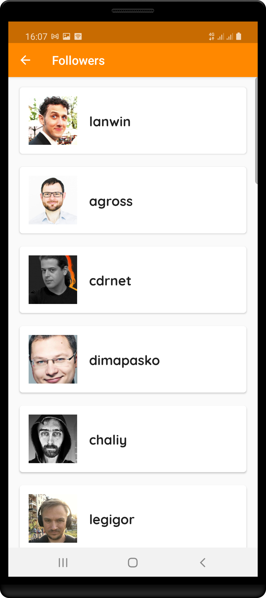

## About GithubX

GithubX app simply let's you search through users on Github, view their basic profile details, followers, and fellow Github users they follow.

#### Goal

Demonstration of clean, scalable, and maintainable codebase in android using:

    * Clean architecture approach
    * SOLID principles and design pattern
    * Layer modularisation
    * MVVM design pattern
    * Unit & Integration Test cases

## Compilation Notes

This app depends on [Github's API](https://docs.github.com/en/free-pro-team@latest/rest/reference/users) which makes use of your Github access token. Obtain your Github access token and replace the value of `API_TOKEN` in your `gradle.properties` file with the token. See [how to obtain Github API access token](https://docs.github.com/en/free-pro-team@latest/github/authenticating-to-github/creating-a-personal-access-token)

## Screenshots

    

